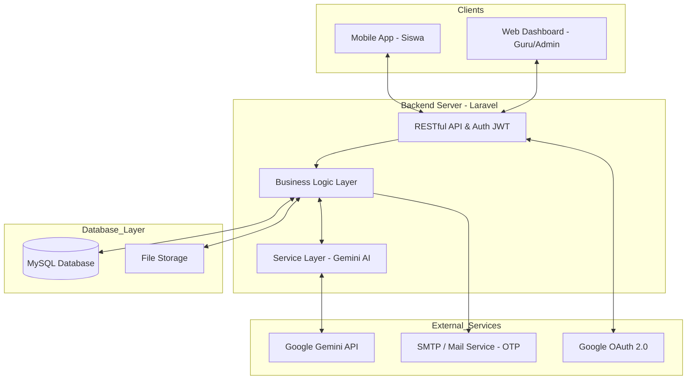

# 🏗️ Sebaya System Architecture

Dokumentasi ini menjelaskan arsitektur teknis dari platform **Sebaya**, mencakup komponen utama, aliran data, dan integrasi layanan pihak ketiga.

---

## 🖼️ High-Level Architecture

Platform Sebaya menggunakan arsitektur **Client-Server** dengan pendekatan **Service-Oriented** untuk integrasi AI.

---

## 🛠️ Technology Stack

| Layer | Technology | Deskripsi |
|:--- |:--- |:--- |
| **Backend** | Laravel 10/11 (PHP) | Framework utama untuk logika bisnis dan API. |
| **Database** | MySQL | Penyimpanan data relasional (User, Jurnal, Soal, Sesi). |
| **Authentication** | JWT (JSON Web Token) | Autentikasi stateless untuk Mobile & Web Dashboard. |
| **AI Engine** | Google Gemini | Digunakan untuk analisis sentimen mood dan chatbot. |
| **Frontend Web** | Blade & TailwindCSS | Antarmuka dashboard untuk manajemen guru dan monitoring. |
| **Infrastructure** | SMTP Service | Pengiriman kode OTP untuk verifikasi akun. |

---

## 🔄 Core Data Flow

### 1. Alur Mood Tracking dengan AI
1. Siswa menginput level mood (1-5) melalui **Mobile App**.
2. **Backend** menerima request, mengambil data jurnal terakhir siswa sebagai konteks tambahan.
3. Konteks tersebut dikirim ke **Gemini Service** melalui API.
4. **Gemini AI** menghasilkan respon suportif yang dipersonalisasi.
5. Respon disimpan di database dan dikirim kembali ke **Mobile App** secara real-time.

### 2. Alur Screening (DASS-21)
1. Siswa memulai sesi screening.
2. Backend menghasilkan set pertanyaan dari **Database**.
3. Jawaban disimpan secara bertahap (incremental) untuk mencegah kehilangan data.
4. Saat submit, Backend menghitung skor berdasarkan bobot dimensi (Depresi, Kecemasan, Stres).
5. **AI** memberikan interpretasi tambahan berdasarkan skor akhir untuk rekomendasi tindakan.

---

## 🛡️ Security & Scalability
- **Stateless Auth**: Menggunakan JWT di mobile untuk skalabilitas server.
- **Transaction Safety**: Operasi pada Jurnal dan Screening menggunakan *Database Transactions* (Commit/Rollback) untuk menjaga integritas data.
- **Service Layering**: Pemisahan logika AI dalam `GeminiService` memudahkan penggantian engine AI di masa depan tanpa mengubah API controller.

---
© 2026 Sebaya Tech Team. All rights reserved.
